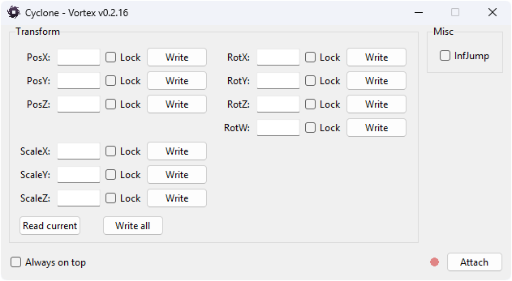

# Cyclone
A WIP Vortex Exploit  
Get the latest version [here](https://github.com/mathhuge/Cyclone/releases/download/v0.3-v0.2.22/Cyclone.exe)! (v0.3-v0.2.22)  
(This injects a DLL into Vortex, so your antivirus might flag it, whitelist it if it does!)  
Now without fixed offsets!
  

  
### Current Capabilities:
- Reading Values
- Writing Values
- Locking Values

### Transform:
- PosX (float, replicated)
- PosY (float, replicated)
- PosZ (float, replicated)
- ScaleX (float, local)
- ScaleY (float, local)
- ScaleZ (float, local)
- RotX (float, local)
- RotY (float, replicated)
- RotZ (float, local)
- RotW (float, replicated)  

(Rig warping caused by rotation is client-sided)

### Misc:
- InfJump (bool, replicated)
